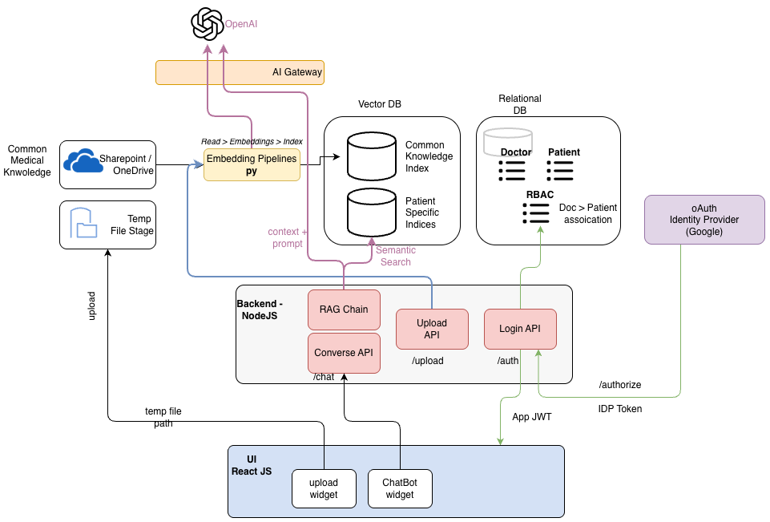

# Medical RAG Application

A simple **Medical RAG\* application that supports both **common medical knowledge** and **user-specific (patient) documents\*\*, enabling secure and contextual AI-powered conversations.

### High-Level Design

This is a conversational AI application built on a RAG architecture:

- Common medical knowledge is shared across all users
- User-specific medical records are private and scoped per user
- Both scopes are searched together at query time to generate grounded responses

Target Design


---

### 🧠 Embeddings & Knowledge Storage

- Uses an embedding pipeline to generate vector embeddings
- Embeddings are stored in **Postgres with pgvector**
- Knowledge separation is handled via metadata (not separate tables)

### Knowledge Scopes

- **Global (Common) Knowledge**
  - Shared medical reference material
  - Stored with:
    - `scope = "global"`
    - `owner_id = NULL`

- **User / Patient-Specific Knowledge**
  - Uploaded medical records (PDFs, reports, notes)
  - Stored with:
    - `scope = "user"`
    - `owner_id = <user_id>`

#### RAG Conversations

The application exposes APIs that support:

#### Document Upload

- Users can upload documents
- Documents are embedded and stored under the **user scope**

#### Chat / Completions API

- OpenAI-compatible, schema-based API
- At query time:
  - Retrieves relevant context from:
    - Global (common) medical knowledge
    - User-specific documents
  - Attaches retrieved context to the LLM prompt
  - Returns a contextual and grounded response

#### 🔐 Authentication & Sign-Up

- Basic sign-up using:
  - User ID
  - Password

#### Run

- sample .env in boht /rag and /ui

Install dependencies and run backend

Backend

```bash
pip install -r req.txt
uvicorn app:app --reload
```

UI

```bash
npm install
npm run:dev
```

#### Advanced Features

- Create oAuth based signup with IDP like google.
- Protect all APIs with JWT
- Extract userid from JWT and attach in retrive queries to protect access controls of user specific knwoledge to specfic users.
